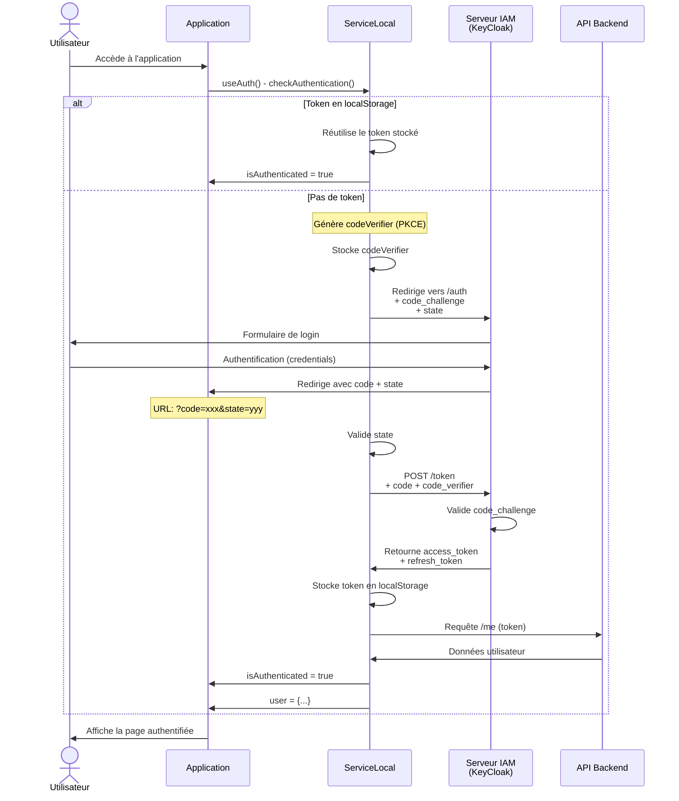
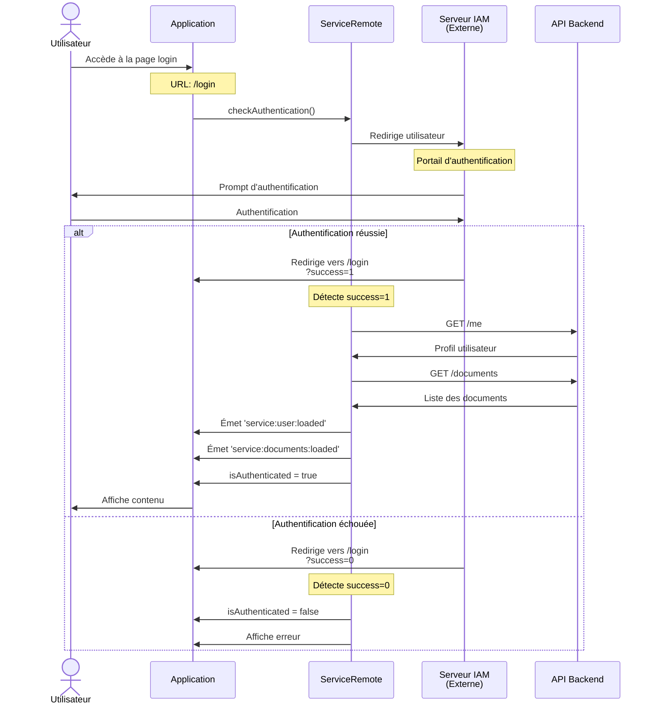
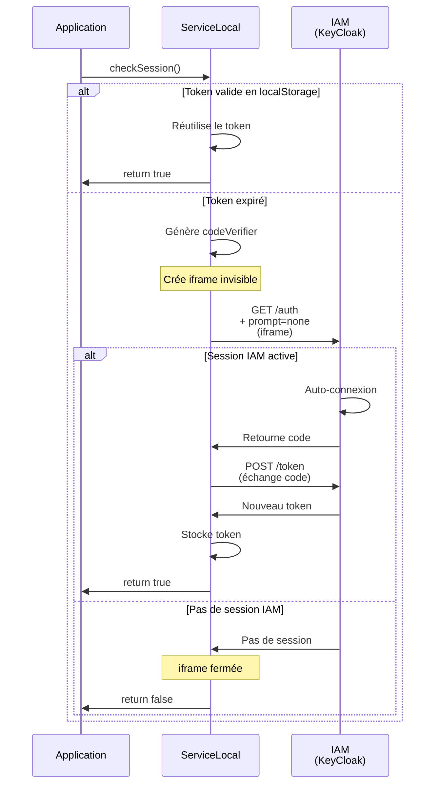

# Diagramme de Séquence - Authentification

## Vue d'ensemble

Ce document décrit le flux d'authentification du service. Il existe deux modes d'authentification : **Local** (OAuth2 avec PKCE) et **Remote** (IAM distant).

---

## Mode Local (OAuth2 avec PKCE)



**Points clés:**
- **PKCE (Proof Key for Code Exchange)**: Sécurise le flux OAuth2
  - `code_verifier` généré et stocké localement
  - `code_challenge` envoyé à l'autorisation
  - `code_verifier` transmis à l'échange de token
- **Token stocké localement** pour les requêtes suivantes
- **Refresh automatique** si token expiré

---

## Mode Remote (IAM Distant)



**Points clés:**
- **Redirection externe** pour l'authentification
- **Fetch des ressources** après retour réussi
- **Événements** pour notification des données chargées
- **Pas de stockage local** du token (géré côté serveur)

---

## Flux de Vérification de Session Silencieuse



**Points clés:**
- **SSO Silencieux**: Utilise `prompt=none` pour éviter le formulaire
- **Iframe invisible**: Vérifie la session sans redirection
- **Renouvellement automatique**: Si session active
- **Dégradation gracieuse**: Si pas de session, retourne false

---

## Stockage Persistant

```json
{
  "service": {
    "connexion": {
      "token": {
        "authenticator": "authenticator:oauth2",
        "access_token": "...",
        "refresh_token": "...",
        "expires_in": 3600,
        "token_type": "Bearer",
        "scope": "basic",
        "expires_at": 1730393104613
      }
    }
  }
}
```

---

## Callbacks et Événements

### useAuth Callbacks
```javascript
const { isAuthenticated, user, checkAuthentication } = useAuth({
  service,
  onLogin: () => { /* Utilisateur connecté */ },
  onLogout: () => { /* Utilisateur déconnecté */ },
  onError: (error) => { /* Erreur d'authentification */ }
});
```

### Events (ServiceRemote)
- `service:user:loaded` - Données utilisateur chargées
- `service:documents:loaded` - Liste des documents chargée

---

## Configuration Requise

### Variables d'environnement (IamSettings)
- `IamUrl`: URL du serveur IAM (KeyCloak)
- `IamRealm`: Realm KeyCloak
- `IamClientId`: ID client OAuth2
- `IamClientSecret`: Secret client (mode serveur)
- `IamEntrepotApiUrl`: API backend (mode local)
- `IamEntrepotApiUrlRemote`: API distante (mode remote)
