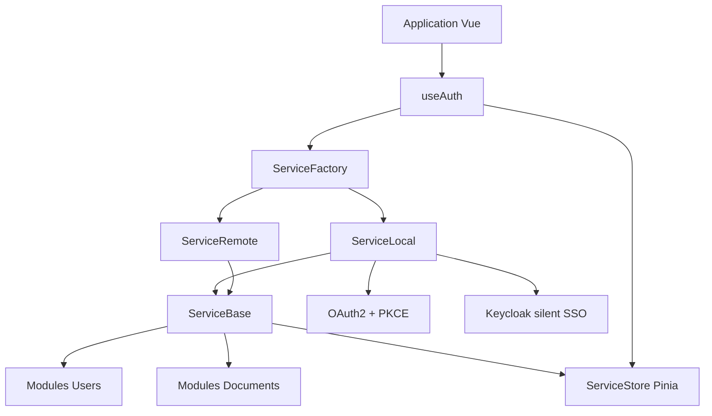
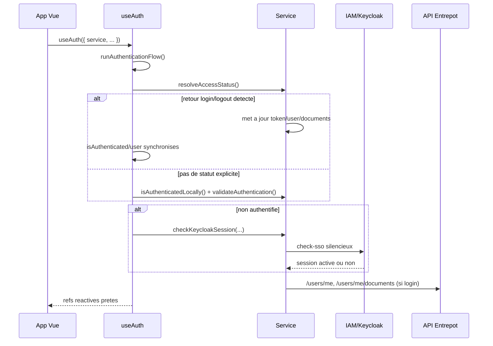

# Fonctionnement interne de la librairie

Ce document explique l'architecture interne de `cartes.gouv.fr-service`, et propose une implementation type côté utilisateur (Vue 3 + Pinia).

## Objectif de la librairie

La librairie fournit une couche unique pour:

- gerer l'authentification IAM (mode `local` OAuth2/PKCE ou mode `remote`)
- centraliser l'etat de connexion dans un store Pinia persistant
- exposer des operations metier sur l'utilisateur et les documents
- simplifier l'integration frontend via le composable `useAuth`

## Architecture interne



## Composants et responsabilites

### 1) Point d'entree public

Le point d'entree exporte:

- `getService` (factory)
- `useAuth` (orchestration auth cote UI)
- `setSettings` (configuration globale)
- `useStore` (acces store service)
- `pinia` (instance Pinia preconfiguree)

### 2) Factory et instanciation

`getService(options)` cree une instance selon `mode`:

- `local` -> `ServiceLocal`
- `remote` -> `ServiceRemote`
- fallback -> `ServiceBase`

Puis la factory applique les extensions (`class`, `instance`, `mixins`) avant retour.

### 3) ServiceBase

`ServiceBase` porte le socle commun:

- etat de connexion (`authenticated`, `user`, `documents`, `error`)
- configuration IAM active (`settings`)
- gestion fetch (`getFetch`, `setFetch`)
- persistance store (`saveStore`)
- verification SSO silencieuse Keycloak (mode iframe)

### 4) ServiceLocal

`ServiceLocal` implemente OAuth2 Authorization Code + PKCE:

- preparation URL login (`getAccessLogin`)
- echange `code` -> `token` (`getAccessToken`)
- gestion logout (`getAccessLogout`, `getAccessLogoutSilent`)
- resolution du statut au retour IAM (`resolveAccessStatus`)
- fetch protege via `OAuth2Fetch`

### 5) ServiceRemote

`ServiceRemote` delegue la logique d'authentification a un IAM distant (redirections login/logout) et reconstruit l'etat utilisateur/documents apres retour.

**Important:**
> le mode `remote` est reserve a une infrastructure _cartes.gouv.fr_ dans laquelle vous etes autorise à utiliser le backend de la brique principale (redirections IAM et endpoints backend associes). Hors de ce contexte, utilisez le mode `local`.

### 6) Modules metier

Les mixins injectent les operations metier dans l'instance de service:

- `Users`: `getUserMe`, `getUser`, `getUserSize`
- `Documents`: listing, pagination, lecture, creation, mise a jour, suppression

### 7) Store Pinia

Le store `service` contient:

- `connexion`: snapshot de l'instance service
- `authentificateSyncNeeded`: drapeau de synchronisation

Le plugin `pinia-plugin-store` persiste ce store dans `localStorage`.

## Sequence d'authentification au demarrage



## Guide d'implementation utilisateur (Vue 3)

### Prerequis

- Vue 3
- Pinia
- pinia-plugin-store
- vue-logger-plugin
- vue-router (optionnel)

### Etape 1 - Initialiser la configuration IAM

```js
import { setSettings } from 'cartes.gouv.fr-service';

setSettings({
  BaseUrl: import.meta.env.BASE_URL,
  IamUrl: import.meta.env.IAM_URL,
  IamRealm: import.meta.env.IAM_REALM,
  IamClientId: import.meta.env.IAM_CLIENT_ID,
  IamCheckSsoDisable: '0',
  IamCheckSsoAutoAuth: '1',
  IamCheckSsoType: 'keycloak',
});
```

### Etape 2 - Brancher Pinia

Version recommandee (instance fournie par la librairie):

```js
import { createApp } from 'vue';
import App from './App.vue';
import { pinia } from 'cartes.gouv.fr-service';

createApp(App)
  .use(pinia)
  .mount('#app');
```

### Etape 3 - Ajouter le logger

Le logger centralise les traces techniques de la librairie et de votre application.
Utilisez la variante suivante comme version finale de votre `main.js`:

```js
import { createApp } from 'vue';
import App from './App.vue';
import { pinia, logger } from 'cartes.gouv.fr-service';

createApp(App)
  .use(pinia)
  .use(logger)
  .mount('#app');
```

### Etape 4 - Creer le service et activer useAuth

```js
import { getService, useAuth, logger } from 'cartes.gouv.fr-service';

const service = getService({ mode: 'local' });

const { isAuthenticated, user, checkAuthentication, checkSession } = useAuth({
  service,
  onLogin: () => logger.info('Utilisateur connecte'),
  onLogout: () => logger.info('Utilisateur deconnecte'),
  onError: (e) => logger.error('Erreur auth', e),
  options: { routing: false },
});
```

### Etape 5 - Redirection login/logout dans la page

```js
const login = async () => {
  const url = await service.getAccessLogin();
  location.href = url;
};

const logout = async () => {
  const url = await service.getAccessLogout();
  location.href = url;
};
```

### Etape 6 - Rehydrater apres refresh navigateur (recommande)

Si vous restaurez l'etat depuis le store persistant, recreez une instance de service a partir des donnees persistees pour retrouver toutes les methodes:

```js
import { getService, useStore } from 'cartes.gouv.fr-service';

const store = useStore();
const persisted = store.connexion;
const service = getService({ mode: 'local', ...persisted });
```

## Recommandations d'implementation

- toujours appeler `setSettings` avant le premier `getService`
- preferer `mode: 'local'` pour un frontend SPA avec flux OAuth2/PKCE
- n'utiliser `mode: 'remote'` que dans une infrastructure _cartes.gouv.fr_ autorisée à consommer le backend de la brique principale
- utiliser `options.routing: true` seulement si vos routes `/login` et `/logout` existent
- conserver la persistance Pinia active pour eviter les pertes de session sur refresh

## Aller plus loin

- Sequence detaillee: `docs/authentication-sequence.md`
- API complete: `docs/api/index.html`
- Exemples d'integration: `demos/demo-1`, `demos/demo-2`, `demos/demo-3`
